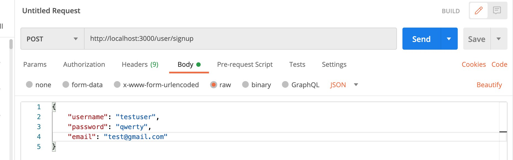

## Практическая работа 0: Создание простейшего API с использованием NodeJS и express

## Начало работы

Задача:

Необходимо разработать API сервер для авторизации пользователей. Пользователи должны иметь возможность зарегистрироваться в системе указав емейл, юзернейм и пароль; авторизироваться при помощи логина и пароля; получить информацию своего профайла (для авторизированных пользователей). Авторизация должна производиться посредством [JWT токена](https://habr.com/ru/post/340146/).

Используемые технологии:

1. Node.js
2. Express
3. MongoDB

API дожно содержать следующие ендпоинт: `/user/signup` - для регистрации нового пользователя; `/user/auth` - для авторизации; `/user/profile` - для получения профайла пользователя;
Самый простейший флоу регистрации и авторизации можно описать так:
При регистрации пользователь в форме на клиенте вводит емейл, юзернейм и пароль. Эти данные передаются на сервер где валидируются. Если данные валидны, то создается новая запись в базе данных, формируется JWT токен в котором зашифровывается id новосозданного пользователя, затем токен отправляется на клиент, где сохраняется в local storage. 
При авторизации, пользователь в форме на клиенте вводит емейл и пароль. На сервере по емейлу находится нужный пользователь, после чего сличаются пароли (на самом деле сличаются хеши паролей). Если есть совпадение, вновь таки, формируется токен с зашифрованным в нем id пользователя, затем токен отправляется на клиент.

## Предварительные требования

Перед началом работы, нужно установить Node.js и npm на свой ПК. 
Node.js это окружение которое позволяет писать на js на сервере. Npm это пакетный менеджер который мы будем использовать чтобы устанавливать зависимости в наш проект. 
Переходим по [ссылке](https://nodejs.org/en/) и устанавливаем актуальную  версию Node.js. 
Чтобы убедиться, что все установилось корректно в консоли выполняем команду 
`node -v`, а затем `npm -v`.
Если оба компонента установлены корректно, то в консоли выведется версия. 

Окей, теперь у нас есть нода, и мы можем выполнять js код на сервере, но помимо этого нам нужно где-то хранить данные. Для этого будем использовать базу mongoDB. Чтобы облегчить установку, создадим базу в облаке. 
Регистрируемся на сайте [mongoDB](https://www.mongodb.com/try) для создания базы в облаке и следуем этому [туториалу](https://www.youtube.com/watch?v=rPqRyYJmx2g) (Интерфейс в видео может слегка отличаться). 
Когда мы все сделали, у нас будет создана база и добавлен пользователь для этой базы. Далее мы должны сгенерировать код для подключения к базе и скопировать его себе. Как это сделать тоже показывается в даном туториале  [туториале](https://www.youtube.com/watch?v=rPqRyYJmx2g).

Сгенерированный код для подключения будет выглядеть примерно так 

`mongodb+srv://<username>:<password>@cluster0.paxev.mongodb.net/myFirstDatabase?retryWrites=true&w=majority`

Мы создали базу, установили ноду, но перед тем как начать писать код нам надо создать папку проекта и установить туда все зависимости. 
Создаем папку проекта и устанавливаем в нее необходимые модули. Для этого пишем в консоли

`mkdir myFirstApp`
`cd myFirstApp`
`npm install express express-validator body-parser bcryptjs jsonwebtoken mongoose --save`

После того как команда выполнится, в проекте появится папка node_modules и package.json. Это регистр наших зависимостей. Теперь пару слов о зависимостях. 

Express это фреймворк для создания API, express-validator - библиотека для валидации данных, body-parser - библиотека для парсинга body в http запросе который будет приходить на наш сервер bcrypt - библиотека которая содержит алгоритмы шифрования (для шифрования пароля), jsonwebtoken - библиотека для создания и валидации токена.

## Создаем заготовку чтобы проверить работоспособность проекта
После всех предыдущих шагов у нас есть все чтобы начать писать код. Внутри папки проекта создаем файл index.js и делаем минимальную заготовку. 

```
const express = require("express");
const bodyParser = require("body-parser");

const app = express();

// PORT
const PORT = process.env.PORT || 3000;

app.get("/", (req, res) => {
  res.json({ message: "API Working" });
});


app.listen(PORT, (req, res) => {
  console.log(`Server Started at PORT ${PORT}`);
});
```
Как видно в коде, мы подключили express и создали один рутовый роут, затем сказали express-у на каком порту развернуть сервер. 
Сохраняем код и запускаем команду `node index.js`. 
Если видим в консоли текст `Server Started at 3000`, значит сервер “поднялся”. Теперь мы можем тестировать наши API endpointы локально. 
Открываем браузер, пробуем зайти на адрес [http://localhost:3000/](http://localhost:3000/)
В отладчике смотрим, что нам в ответ пришло { message: "API Working" }. 
Значит все работает. 

Далее тестируем подключение к базе данных. Создаем файл db.js

```const mongoose = require("mongoose");

const MONGOURI = "сюда вставить строку которую мы получили на 1 шаге";

const InitiateMongoServer = async () => {
  try {
    await mongoose.connect(MONGOURI, {
      useNewUrlParser: true
    });
    console.log("Connected to DB !!");
  } catch (e) {
    console.log(e);
    throw e;
  }
};

InitiateMongoServer(); 
```
Сохраняем код и запускает с помощью команды `node db.js`.
Если видим в консоли сообщение об успешном подключении, переходим к следующим шагам. Если видим ошибку подключения, то возвращаемся на шаг 1)  и проверяем все ли мы сделали правильно, смотрим еще раз туториал. Если не помогло, спрашиваем в чат =)

## Создаем модель пользователя

Когда у вас получилось успешно запустить API сервер и подключиться к базе, создадим модель пользователя в файле models/user.js
```
//FILENAME : models/user.js
const mongoose = require("mongoose");

const UserSchema = mongoose.Schema({
  username: {
    type: String,
    required: true
  },
  email: {
    type: String,
    required: true
  },
  password: {
    type: String,
    required: true
  },
  createdAt: {
    type: Date,
    default: Date.now()
  }
});

// export model user with UserSchema
module.exports = mongoose.model("user", UserSchema);
```
Таким образом, мы объявили какие поля будут присутствовать у пользователя, и какого типа эти поля.

Теперь слегка модифицируем наш файл db.js, и добавим возможность импортировать функцию ```InitiateMongoServer``` и уберем вызов этой функции файле db.js.

```
//FILENAME : db.js

const mongoose = require("mongoose");

const MONGOURI = "сюда вставить строку которую мы получили на 1 шаге";

const InitiateMongoServer = async () => {
  try {
    await mongoose.connect(MONGOURI, {
      useNewUrlParser: true
    });
    console.log("Connected to DB !!");
  } catch (e) {
    console.log(e);
    throw e;
  }
};

module.exports = InitiateMongoServer;

```

 Соберем все воедино  в файле index.js:
 ```
const express = require("express");
const bodyParser = require("body-parser");
const InitiateMongoServer = require("./db");

// Initiate Mongo Server
InitiateMongoServer();

const app = express();

// PORT
const PORT = process.env.PORT || 3000;

// Middleware
app.use(bodyParser.json());

app.get("/", (req, res) => {
  res.json({ message: "API Working" });
});


app.listen(PORT, (req, res) => {
  console.log(`Server Started at PORT ${PORT}`);
});
```
Обратите внимание что мы добавили миддлвар bodyParser и теперь мы можем работать с http body.

## Создаем роут для регистрации

Один роут будет подан вместе с кодом, остальные на уровне алгоритма, который надо будет реализовать самому. 
Для регистрации алгоритм таков:
1. получить email и password от клиента;
2. провалидировать их, проверить что пользователя с таким емейлом не существует;
3. создать новую запись в базе пользователей;
4. зашифровать пароль с помощью [“соли”](https://ru.wikipedia.org/wiki/%D0%A1%D0%BE%D0%BB%D1%8C_(%D0%BA%D1%80%D0%B8%D0%BF%D1%82%D0%BE%D0%B3%D1%80%D0%B0%D1%84%D0%B8%D1%8F)).

Теперь имплементируе данный алгоритм в коде:

```
// Filename : routes/user.js

const express = require("express");
const { check, validationResult} = require("express-validator/check");
const bcrypt = require("bcryptjs");
const jwt = require("jsonwebtoken");
const router = express.Router();

const User = require("../models/user");

/**
 * @method - POST
 * @param - /signup
 * @description - User SignUp
 */

router.post(
    "/signup",
    [
       //используем express validator чтобы проверить валидность данных
       //проверяем что в поле email прилетел валидный емейл, и что пароль 
       //содержит больше 6 симоволов.
       // подробнее можно почитать в описании библиотеки 
       // https://express-validator.github.io/docs/
        check("username", "Please Enter a Valid Username")
        .not()
        .isEmpty(),
        check("email", "Please enter a valid email").isEmail(),
        check("password", "Please enter a valid password").isLength({
            min: 6
        })
    ],
    async (req, res) => {
        const errors = validationResult(req);
        //если есть ошибки валидации, отправляем их клиенту
        if (!errors.isEmpty()) {
            return res.status(400).json({
                errors: errors.array()
            });
        }
        const {
            username,
            email,
            password
        } = req.body;
        try {
            //проверяем что такого пользователя не существует
            let user = await User.findOne({
                email
            });
            //если пользователь с данным емейлом уже зарегистрирован, кидаем ошибку
            if (user) {
                return res.status(400).json({
                    msg: "User Already Exists"
                });
            }

            user = new User({
                username,
                email,
                password
            });

            //солим пароль  
            const salt = await bcrypt.genSalt(10);
            user.password = await bcrypt.hash(password, salt);

            // сохраняем пользователя
            await user.save();

            const payload = {
                user: {
                    id: user.id
                }
            };

            //создаем токен и отправлем на клиент
            jwt.sign(
                payload,
                "randomString", {
                    expiresIn: 10000
                },
                (err, token) => {
                    if (err) throw err;
                    res.status(200).json({
                        token
                    });
                }
            );
        } catch (err) {
            console.log(err.message);
            res.status(500).send("Error in Saving");
        }
    }
);
module.exports = router;
```

В токене зашифровываем id пользователя, для последующего извлечения при авторизации. 
После того как роут добавлен, не забываем подключить его в index.js файле:

```
const express = require("express");
const bodyParser = require("body-parser");
const user = require("./routes/user"); //new addition
const InitiateMongoServer = require("./db");

// Initiate Mongo Server
InitiateMongoServer();

const app = express();

// PORT
const PORT = process.env.PORT || 3000;

// Middleware
app.use(bodyParser.json());

app.get("/", (req, res) => {
  res.json({ message: "API Working" });
});

/**
 * Router Middleware
 * Router - /user/*
 * Method - *
 */

//Здесь подключили наш роут 
app.use("/user", user);

app.listen(PORT, (req, res) => {
  console.log(`Server Started at PORT ${PORT}`);
});
```
Теперь можно протестировать работоспособность роута с помощью утилиты postman https://www.postman.com/. Все так же на localhost отправляем запрос содержащий username, email, password и убеждаемся что в ответ пришел токен. Настройки запроса следующие:
method - `POST`, url - `http://localhost:3000/user/signup`, body - `raw`, type `JSON`.



Также можем протестировать валидацию, заведомо отправляя некорректные данные чтобы убедиться что приходят ошибки. Проверить, что запись была действительно создана можем в облаке mongoDB, если зайдем нашу коллекцию пользователей.

##Создаем роут для логина
Здесь будет подан только алгоритм, код надо написать самим в файле routes/user

1. получить от клиента логин и пароль;
2. провалидировать ввод;
3. найти пользователя с данным емейлом (пример есть в роуте signup);
4. сравнить хеш пароля пользователя и пароля который прислал клиент 
(небольшая подсказка `const isMatch = await bcrypt.compare(password, user.password);`)
5. если хеши совпали, то формируем токен так же как при регистрации и отправляем на клиент.

Подключаем роут аналогично как мы это делали с роутом для регистрации, и так же тестируем через postman. 

Если есть вопросы по тестированию эндпоинтов, можно спросить в чат. 

## Создаем роут для получения профайла

Ранее в токене мы зашифровывали id пользователя. Ожидается, что клиент будет передавать этот токен в каждом запросе. Теперь наша цель - прикрутить проверку токена в приватных роутах (получение профайла это приватный роут). Так мы сможем идентифицировать пользователя, когда расшифруем токен и получим id. 

Cделаем миддлвар который будет выполнять эту задачу. По сути, обработчики, которые навешаны на роуты тоже являются миддлварами. Наш миддлвар будет выполняться перед ними, извлекать id пользователя и прокидывать его дальше. Таким образом, все последующие обработчики будет иметь доступ к этому id. 

```
//middleware/auth
const jwt = require("jsonwebtoken");

module.exports = function(req, res, next) {
  const token = req.header("token");
  if (!token) return res.status(401).json({ message: "Auth Error" });

  try {
    const decoded = jwt.verify(token, "randomString");
    req.user = decoded.user;
    next();
  } catch (e) {
    console.error(e);
    res.status(500).send({ message: "Invalid Token" });
  }
};
```
Не забываем подключить миддлвар в index.js с помощью app.use

В файле `routes/user` добавляем еще один роут по аналогии с остальными. Мы прокинули айди пользователя в объект `req`  и теперь можем обращаться к нему через `req.user.id`.

Пример как найти пользователя по email у вас уже есть, по аналогии находим пользователя по id и возвращаем на клиент. 

Теперь у нас есть ядро приложения. Эндпоинты для логина, регистрации и профиля пользователя. При желании можно добавить регистрацию через соц сети, это бонусное задание. 


